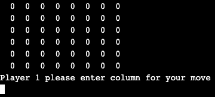
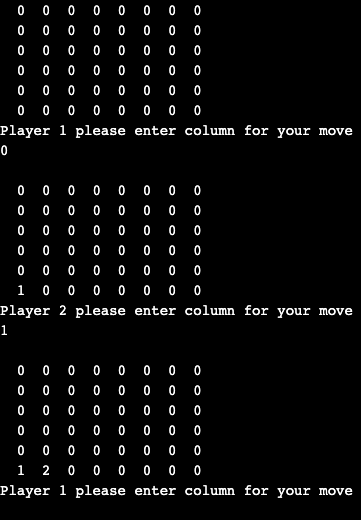
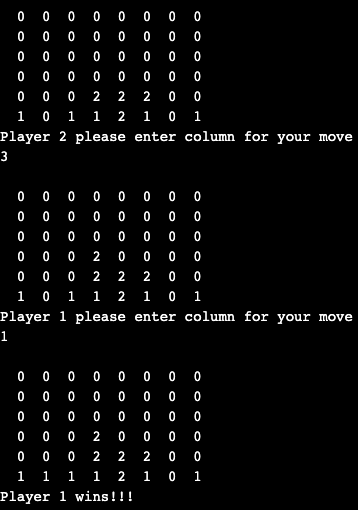
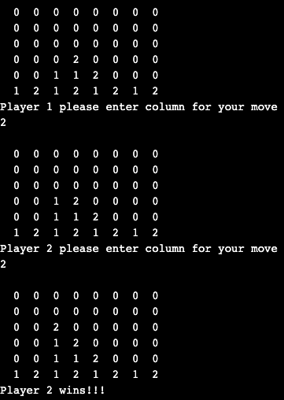

# Connect 4 Game
This project is a simple Connect 4 game for two players.  

## The Rules
- Player 1 will be asked to enter a number from 0 - 7. This corresponds to the 8 columns i.e. left to right.
- Then Player 2 will be asked the same.
- The players can win by connecting four of their numbers:
  - Horizantal
  - Vertical
  - Left Diagonal
  - Rigth Diagonal
- The game ends once Player 1 or 2 has connected four of their numbers.

## Purpose
This is a simple Connect 4 game in C to demonstrate the basic concepts of C language. 

## Concepts Used
- User input
- For loop
- Do while loop
- If statement
- Function calls

### When Program is first compiled and executed:

### Beginning of the game:

### Vertical Win (|):

### Horizontal Win (-):

### Diagonal Left Win (\):

### Diagonal Right Win (/):

Feel free to download the code and run in an IDE that supports C.
This game can be played in the terminal once it has been complied.

Here is the link to my portfolio webpage:
- https://sleepernova.github.io/ 

