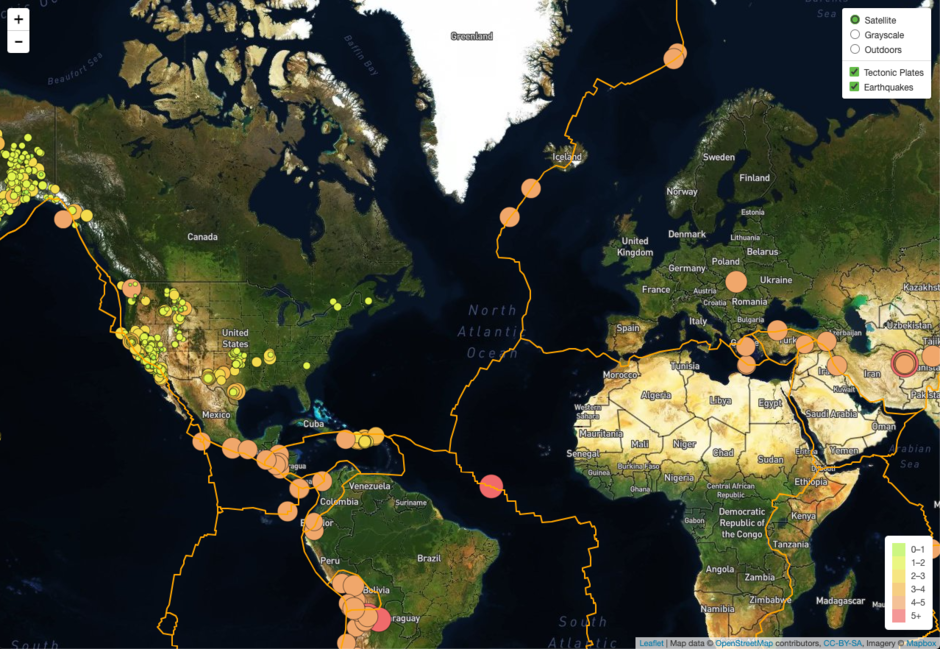

# Earthquake and Tectonic Plates Visualization

## Purpose
This dashboard is meant to see the power of data when it is taken from credible sources
like <a href = "http://earthquake.usgs.gov/earthquakes/feed/v1.0/geojson.php" target = "_blank"> USGS GeoJSON Feed. </a> This allows people to learn more about the disasters that are
facing our planet.

Here is the link to the Interactive Dashboard:
- https://sleepernova.github.io/Projects%20in%20HTML:CSS:JS/Earthquake%20and%20Tectonic%20Plates%20Visualization%20/Leaflet-Part-2/index.html