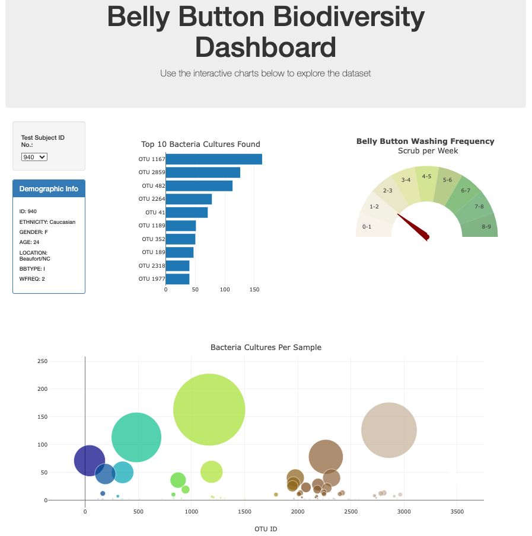

# Interactive Dashboard 

## Purpose
This dashboard is meant to see the power of data when it is taken from the D3 library.
While also making it more interavtice so the user is able to view various data per test
ID along with demographic to see if there is any correlations.

Here is the link to the Interactive Dashboard:
- https://sleepernova.github.io/Projects%20in%20HTML:CSS:JS/Interactive%20Dashboard/index.html