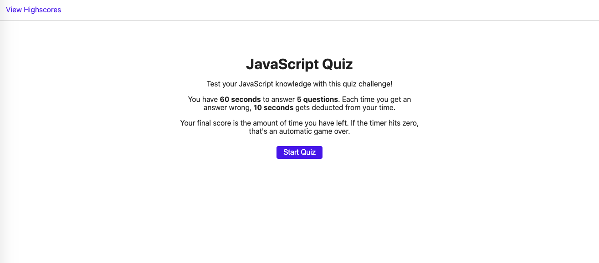

# JavaScript Quiz
This project is a timed quiz on JavaScript.  

## The Rules
- The quiz is made up of 5 questions presented one at a time
- The user has 60 seconds to complete the quiz
- Everytime the user selects an answer:
  - A message tells them if the answer was correct/incorrect
  - If the answer was incorrect, 10 seconds is deducted from the timer
- The game ends once the timer hits 0 or the user answers all the questions

### Scoring
- The user's remaining time is their final score
- The user may save their score to their local storage by entering their initials
- All the saved scores can be viewed on the highscores page

## Purpose
This quiz is for people learning JavaScript who want to see how their knowledge compares to their others. 

## Concepts Used
### CSS
- CSS Transitions
- Breakpoints

### Javascript
- Classes
- Event Listeners
- `setTimeout`/`setInterval`
- Using Local Storage

### Additional Resources
- [Font Awesome 5.14](https://fontawesome.com/)

Here is the link to my portfolio webpage: \
https://sleepernova.github.io/ 