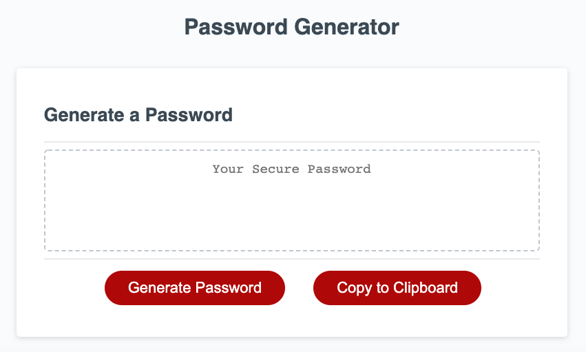

# Password Generator
This page generates a random password based on the user's responses to the following criteria: 
- Length of the password (min-length: 8, max-length: 128)
- Allowing uppercase letters
- Allowing lowercase letters
- Allowing numerals
- Allowing special characters 

Once the password has been generated, the user has the option to 'Copy to Clipboard' by pressing the button.
Otherwise, they can just generate another password by pressing the 'Generate Password' button.

## Purpose
This application was built for people who have access to sensitive information and need a strong password. 

## Main JavaScript Concepts Used 
- Objects
- Arrays
- Loops (Do/while, while, for)
- Browser functions (prompt, confirm, alert)

Here is the link to the Password Generator:
- https://sleepernova.github.io/Projects%20in%20HTML:CSS:JS/Password%20Generator/index.html

Here is the link to my portfolio webpage:
- https://sleepernova.github.io/ 