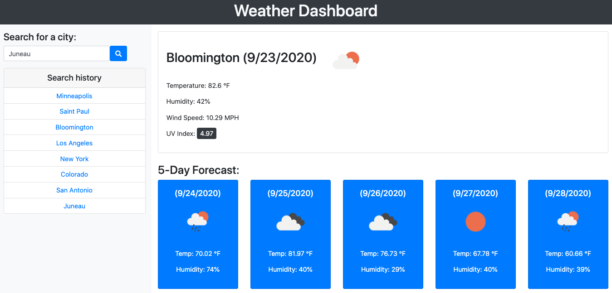

# Weather Dashboard
A dashboard that displays the weather for a searched city. 

The dashboard features:
- an overview of the current weather
- a colour-coded UV index [(Based on this scale)](https://en.wikipedia.org/wiki/Ultraviolet_index#Index_usage)
- a future, five-day weather forecast

When a valid city name is entered, the name is saved as part of a search history list and can be clicked on again to access the same data. The last search is saved to local storage so that it can be displayed when the page is reloaded.

## Purpose
This dashboard is meant for travelers who want to plan ahead for the upcoming weather in different cities.

Here is the link to the Weather Dashboard:
- https://sleepernova.github.io/Projects%20in%20HTML:CSS:JS/Weather%20Dashboard/index.html

Here is the link to my portfolio webpage:
- https://sleepernova.github.io/ 

## Resources 
### API(s) 
- [Open Weather API](https://openweathermap.org/api)

### CSS Framework
- [Bootstrap 4](https://getbootstrap.com/)

### Icons
- [Font Awesome 5](https://fontawesome.com/)