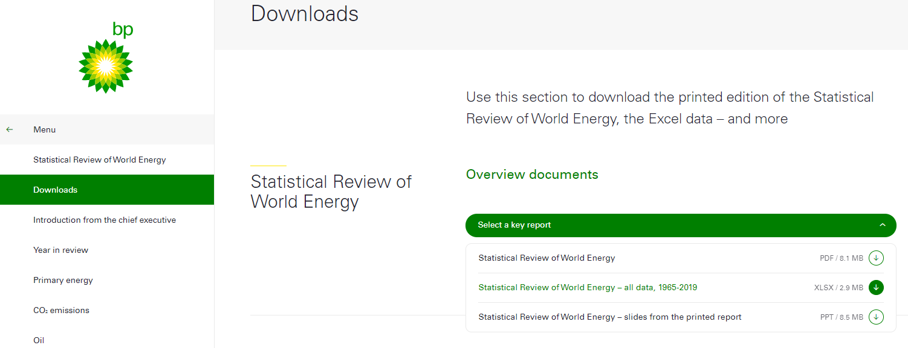

# World Energy Consumption and Generation

## Background

**Data Source**  
https://www.bp.com/en/global/corporate/energy-economics/statistical-review-of-world-energy/downloads.html

**Data Set**

The data that was used for this project is:  "Statistical Review of World Energy - all data, 1965-2019"

## Summary
It is know that the Earth’s resources are limited. I will discover what energy sources would look like in the near future. Out of the different energy sources the focus will be the top 2 energy production and consumption sources: Oil and Gas. The premise is to predict the consumption and production of both sources in the next 5 years. 

Data cleaning will be done using Python Pandas to perform the ETL (Extract, Transform, and Load) process for the new cleaned csv files. This will allow me to make data driven decisions to investigate the premise of the project. 

Prediction models for oil and gas energy production and consumption with Scikit-Learn (Machine Learning). I will train and test the prediction model based on historical data to gauge accuracy for future predictions based on trends. Tableau will be used to generate the visualizations to illustrate the narrative of the energy sources (oil and gas). To showcase the data analysis I will build a webpage using HTML, CSS, and Bootstrap to present all of the findings.

## Programming Languages and Platforms
* Python - Used to extract, transform and load (ETL) data sets and code machine learning models.
	* Libraries
		* Pandas
		* Scikit-learn
* HTML - Used to build basic structure of website employing bootstrap library.
* CSS - Used to format images, title, tables, headers and drop downs.
* Tableau - Used to generate visualizations of data set and machine learning models.  Visualizations are embedded into website.

## Webpage
If you would like to see the webpage click [here](https://sleepernova.github.io/Projects%20in%20HTML:CSS:JS/World%20Energy%20Consumption%20and%20Generation/index.html "here")

## Additional Resources
[World Population](https://data.worldbank.org/indicator/SP.POP.TOTL?end=2019&start=2010/ "World Population")  
[Gross Capital Formation (% of GDP)](https://data.worldbank.org/indicator/NE.GDI.TOTL.ZS/ "GDP %")  
[Inflation, Consumer Prices (Annual %)](http://https://data.worldbank.org/indicator/FP.CPI.TOTL.ZG/ "Inflation")  
[Taxes on Goods and Services (% of Revenue)](http://https://data.worldbank.org/indicator/GC.TAX.GSRV.RV.ZS?view=chart/ "Taxes on Goods and Services")  
[Tableau Visualizations](https://public.tableau.com/app/profile/francisco.saavedra/vizzes "Tableau Visualizations")
